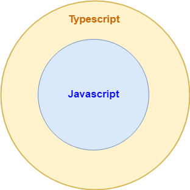

# What is Typescript ?

1. Typescript is superset of Javascript.
2. Typescript shares same syntax as javascript, but adds something extra to it (strong typing system like java,c++ ).
3. Typescript provide extra capabilities by adding **_type_** to javascript.

   

## Why to use Typescript ?

Typescript allows developers to bind the type to variables and functions return statements. That helps to remove all the type error during runtime.

example:

**_*javascript*_**

```js
//no type information with variable
let name = "shubham";

name = 12;

name = true;

// all the assignment is correct.
```

**_typescript_**

```ts
// type information is provided while declaring the variable
let name: string = "shubham";

//if we assign another type data to name
//then we get error
name = 1232; // error :
```

Lets understand more :
suppose we are trying to access any property of the object that is not there.
Then in typescript we will get error before execution of program itself.
But in javascript we will get the error during runtime which is more dangerous.

> > TypeScript uses compile time type checking. Which means it checks if the specified types match before running the code, not while running the code.
